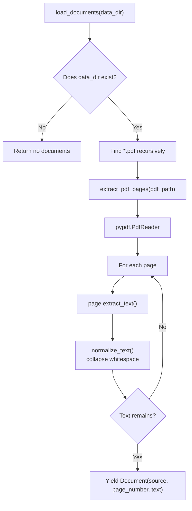
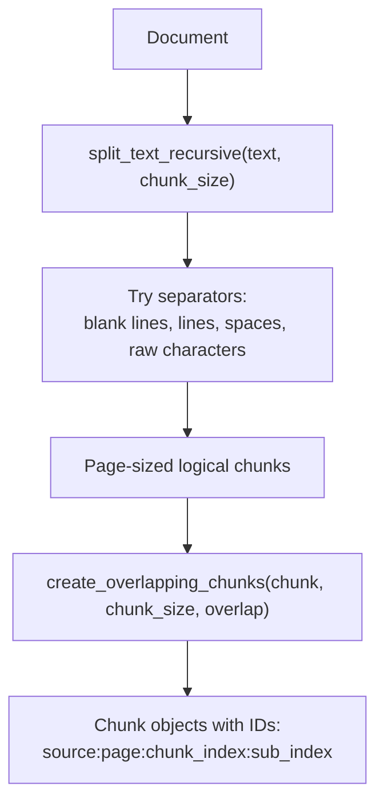
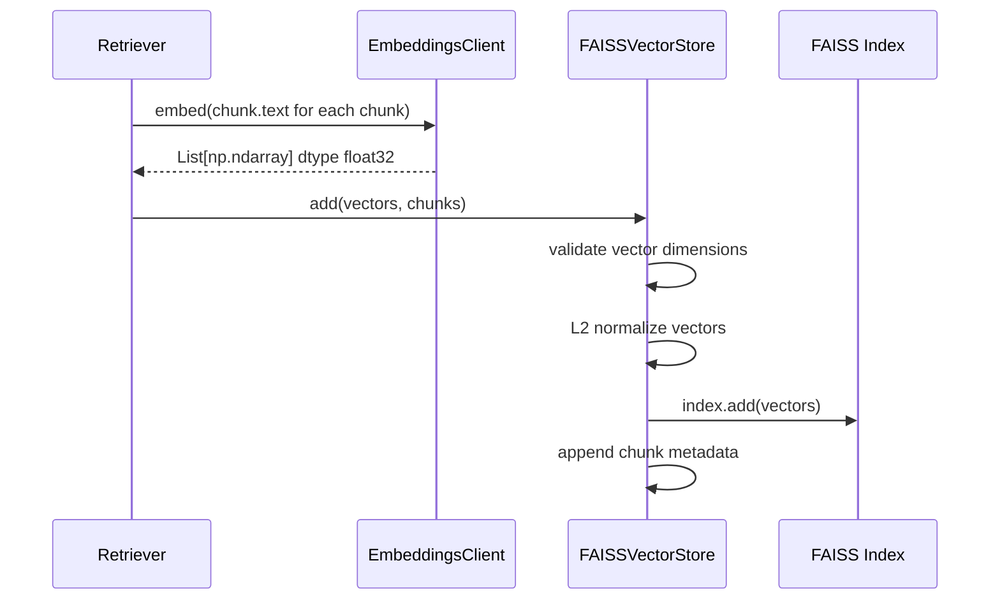
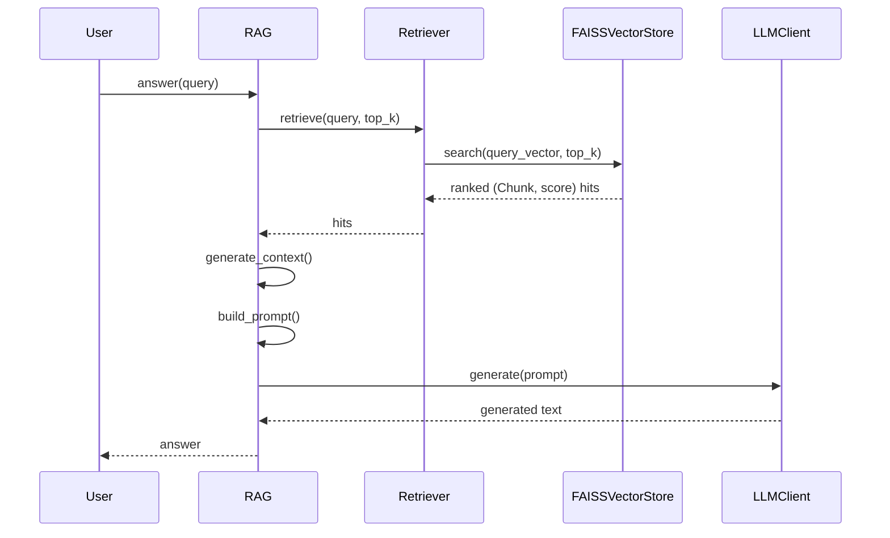

# Chat Bot RAG

This project is a small retrieval-augmented generation (RAG) prototype for answering questions from PDF documents. It reads PDFs from `data/`, extracts page text, splits that text into metadata-rich chunks, embeds the chunks with a local Sentence Transformers model, stores them in a FAISS vector index, retrieves relevant chunks for a user query, and sends the retrieved context to a Groq-hosted chat model.

The repository is currently a CLI-based Python project. The main behavior is exposed through Python modules under `app/`, with `app.main` providing a command-line entrypoint for asking questions against PDFs in `data/`.

## Project Structure

```text
.
+-- app/
|   +-- chunker.py          # Recursive text splitting and overlap chunk creation
|   +-- chunking_lab.py     # Small experimental fixed-size chunking helper
|   +-- embeddings.py       # SentenceTransformer embedding client
|   +-- first_llm_call.py   # Standalone Groq smoke-test script
|   +-- ingest.py           # PDF loading, page extraction, whitespace normalization
|   +-- llm.py              # Groq chat-completion wrapper
|   +-- load_pdf.py         # Standalone PDF inspection script
|   +-- main.py             # CLI entrypoint for asking questions against PDFs
|   +-- rag.py              # RAG prompt/context orchestration
|   +-- retriever.py        # Embedding + vector-store retrieval coordinator
|   +-- test_setup.py       # Python environment smoke-test script
|   +-- vector_store.py     # FAISS vector index and persistence
+-- data/
|   +-- sample.pdf          # Sample source PDF
+-- notebooks/              # Present but currently empty
+-- tests/                  # Unit tests for the RAG building blocks
+-- requirements.txt        # Python dependency list
+-- .gitignore              # Ignores local envs, secrets, caches, and generated indexes
```

## High-Level Architecture

```mermaid
flowchart LR
    PDF["PDF files in data/"] --> Ingest["app.ingest"]
    Ingest --> Docs["Document objects<br/>source, page_number, text"]
    Docs --> Chunker["app.chunker"]
    Chunker --> Chunks["Chunk objects<br/>id, text, source, page_number"]
    Chunks --> Embedder["app.embeddings<br/>SentenceTransformer"]
    Embedder --> Vectors["float32 embedding vectors"]
    Vectors --> Store["app.vector_store<br/>FAISS IndexFlatIP"]
    Chunks --> Store
    User["User query"] --> Retriever["app.retriever"]
    Retriever --> EmbedQuery["Embed query"]
    EmbedQuery --> Store
    Store --> Hits["Ranked chunks + scores"]
    Hits --> RAG["app.rag"]
    RAG --> Prompt["Prompt with retrieved context"]
    Prompt --> LLM["app.llm<br/>Groq chat completion"]
    LLM --> Answer["Generated answer"]
```



## Ingestion Flow



`app.ingest` is responsible for making raw PDF content usable by the rest of the pipeline. Each non-empty PDF page becomes a `Document`. The source path and page number are preserved so retrieved answers can cite where context came from.

## Chunking Flow



`app.chunker` uses two strategies:

- `split_text_recursive` tries to preserve larger semantic boundaries first, such as paragraphs and lines.
- `create_overlapping_chunks` creates fixed-size sliding windows with overlap so nearby context is not lost at chunk boundaries.

The final `Chunk` dataclass carries `id`, `text`, `source`, and `page_number`.

## Embedding and Indexing Flow



`app.embeddings.EmbeddingsClient` defaults to `BAAI/bge-small-en-v1.5`, or the value of `EMBEDDING_MODEL` if set. It returns `numpy.float32` vectors.

`app.vector_store.FAISSVectorStore` defaults to `faiss.IndexFlatIP`. Because vectors are L2-normalized before indexing and querying, inner product behaves like cosine similarity.

The vector store can be saved and loaded:

- `vector_store.index` stores the FAISS index.
- `vector_store.pkl` stores dimension, normalization setting, and chunk metadata.

## Query and Answer Flow



`app.rag.RAG` limits final context with `max_chunks` after retrieval. Each context entry includes:

- source PDF path
- page number
- similarity score
- chunk text

If no context is retrieved, the prompt instructs the model to answer only if possible and otherwise say there is not enough information.

## Main Components

| Module | Main items | Responsibility |
| --- | --- | --- |
| `app.ingest` | `Document`, `normalize_text`, `extract_pdf_pages`, `load_documents` | Read PDFs and produce page-level documents. |
| `app.chunker` | `Chunk`, `split_text_recursive`, `create_overlapping_chunks`, `chunk_document` | Split page text into searchable chunks with source metadata. |
| `app.embeddings` | `EmbeddingsClient` | Convert chunk text and queries into embedding vectors. |
| `app.vector_store` | `FAISSVectorStore` | Store vectors, search by similarity, and persist/load FAISS indexes. |
| `app.retriever` | `Retriever` | Build an index from chunks and retrieve ranked matches for a query. |
| `app.rag` | `RAG` | Convert retrieved chunks into context, build prompts, and return LLM answers. |
| `app.llm` | `LLMClient` | Call Groq chat completions. |
| `app.load_pdf` | script | Print basic diagnostics for `data/sample.pdf`. |
| `app.first_llm_call` | script | Smoke-test Groq with a simple prompt. |
| `app.chunking_lab` | `split_into_chunks` | Experimental fixed-length chunking helper. |

## External Services and Libraries

The project uses:

- `pypdf` to extract text from PDFs.
- `sentence-transformers` to generate local embeddings.
- `numpy<2.0` for vector handling. This constraint avoids compatibility/metadata issues seen with the newer NumPy 2.x line in this environment.
- `faiss-cpu` for vector similarity search.
- `groq` for hosted chat completions.
- `python-dotenv` in the standalone first LLM smoke-test script.
- `pytest` for tests.

The installed embedding model may download model weights the first time it runs. Use a fresh `.venv` environment; the older `venv` folder was removed from Git tracking because virtual environments should stay local.

## Environment Variables

The app reads these values:

| Variable | Used by | Purpose | Default |
| --- | --- | --- | --- |
| `GROQ_API_KEY` | `app.llm.LLMClient`, `app.first_llm_call` | Required API key for Groq calls. | None |
| `GROQ_MODEL` | `app.llm.LLMClient` | Chat model used by the reusable LLM client. | `llama-3.3-70b-versatile` |
| `EMBEDDING_MODEL` | `app.embeddings.EmbeddingsClient` | Sentence Transformers model name. | `BAAI/bge-small-en-v1.5` |

The repository has a `.env` file locally, and `.gitignore` contains `.env`, so secrets should stay out of version control.

## Example Usage

The easiest way to run the full pipeline is:

```powershell
python -m app.main "What is this PDF about?"
```

By default, this command reads PDFs from `data/`, chunks them, builds an in-memory FAISS index, retrieves relevant chunks, sends context to Groq, and prints the answer plus source pages.

You can also control the run:

```powershell
python -m app.main "Ask your question here" --data-dir data --top-k 5 --max-chunks 3
```

The modules can also be composed manually:

```python
from pathlib import Path

from app.chunker import chunk_document
from app.embeddings import EmbeddingsClient
from app.ingest import load_documents
from app.llm import LLMClient
from app.rag import RAG
from app.retriever import Retriever
from app.vector_store import FAISSVectorStore

documents = list(load_documents(Path("data")))
chunks = []
for document in documents:
    chunks.extend(chunk_document(document, chunk_size=800, overlap=100))

embedder = EmbeddingsClient()
sample_vector = embedder.embed_query("dimension probe")
store = FAISSVectorStore(dimension=len(sample_vector))

retriever = Retriever(embedder, store)
retriever.build_index(chunks)

rag = RAG(retriever=retriever, llm=LLMClient(), max_chunks=3)
answer = rag.answer("What is this PDF about?", top_k=5)
print(answer)
```

The `sample_vector` call is used to discover the embedding dimension required by `FAISSVectorStore`.

## Setup

Use `.venv` for the local environment. This folder is ignored by Git, so dependency installs will not be pushed to GitHub.

```powershell
python -m venv .venv
.\.venv\Scripts\Activate.ps1
python -m pip install --upgrade pip
pip install --no-cache-dir -r requirements.txt
```

If dependency resolution behaves strangely, this known-good install command also works:

```powershell
pip install --no-cache-dir "numpy<2.0" sentence-transformers faiss-cpu pypdf groq python-dotenv pytest
```

Create a `.env` file or set environment variables in your shell:

```text
GROQ_API_KEY=your_groq_api_key
GROQ_MODEL=llama-3.3-70b-versatile
EMBEDDING_MODEL=BAAI/bge-small-en-v1.5
```

## Useful Commands

Activate the local environment:

```powershell
.\.venv\Scripts\Activate.ps1
```

Verify the embedding stack:

```powershell
python -c "import importlib.metadata as m; print(m.version('numpy'))"
python -c "from sentence_transformers import SentenceTransformer; print('sentence-transformers OK')"
```

Run all tests:

```powershell
pytest
```

Ask a question against PDFs in `data/`:

```powershell
python -m app.main "What is this PDF about?"
```

Inspect the sample PDF:

```powershell
python app\load_pdf.py
```

Smoke-test the Groq client:

```powershell
python app\first_llm_call.py
```

## Test Coverage

The test suite covers the main contracts:

- `tests/test_ingest.py` checks whitespace normalization and empty directory behavior.
- `tests/test_chunker.py` checks recursive splitting, overlapping windows, and chunk metadata.
- `tests/test_embeddings.py` monkeypatches `SentenceTransformer` to verify embedding output shape and dtype.
- `tests/test_vector_store.py` checks FAISS add/search and save/load behavior.
- `tests/test_retriever.py` checks index building and ranked retrieval with fake embeddings.
- `tests/test_rag.py` checks context generation, prompt construction, and LLM invocation with fakes.

## Current Findings

- The core RAG pipeline is modular and testable: ingestion, chunking, embeddings, vector storage, retrieval, prompt construction, and LLM generation are separated into focused modules.
- `app.main` provides a CLI entrypoint that performs the full ingest-to-answer workflow from one command.
- The app was verified manually with a fresh `.venv` and the command `python -m app.main "What is this PDF about?"`.
- The previous checked-in `venv` caused dependency metadata errors, including `SentenceTransformer` import failures and NumPy version detection errors. Virtual environments are now ignored and should not be committed.
- `numpy<2.0` is used because the tested environment worked reliably with that constraint.
- The vector store requires callers to know the embedding dimension before construction. The example above probes it from the embedder.
- `load_documents` silently skips PDFs that raise exceptions. That keeps ingestion resilient, but production code should log skipped files.
- `.gitignore` excludes `.env`, `venv/`, `.venv/`, caches, and generated FAISS/vector-store artifacts.

## Suggested Next Improvements

1. Add logging for skipped PDFs during ingestion.
2. Persist a built vector store under a dedicated ignored directory such as `storage/`.
3. Add a streaming or interactive chat mode for repeated questions.
4. Consider replacing the broad dependency list with a smaller, tested production requirements file.
